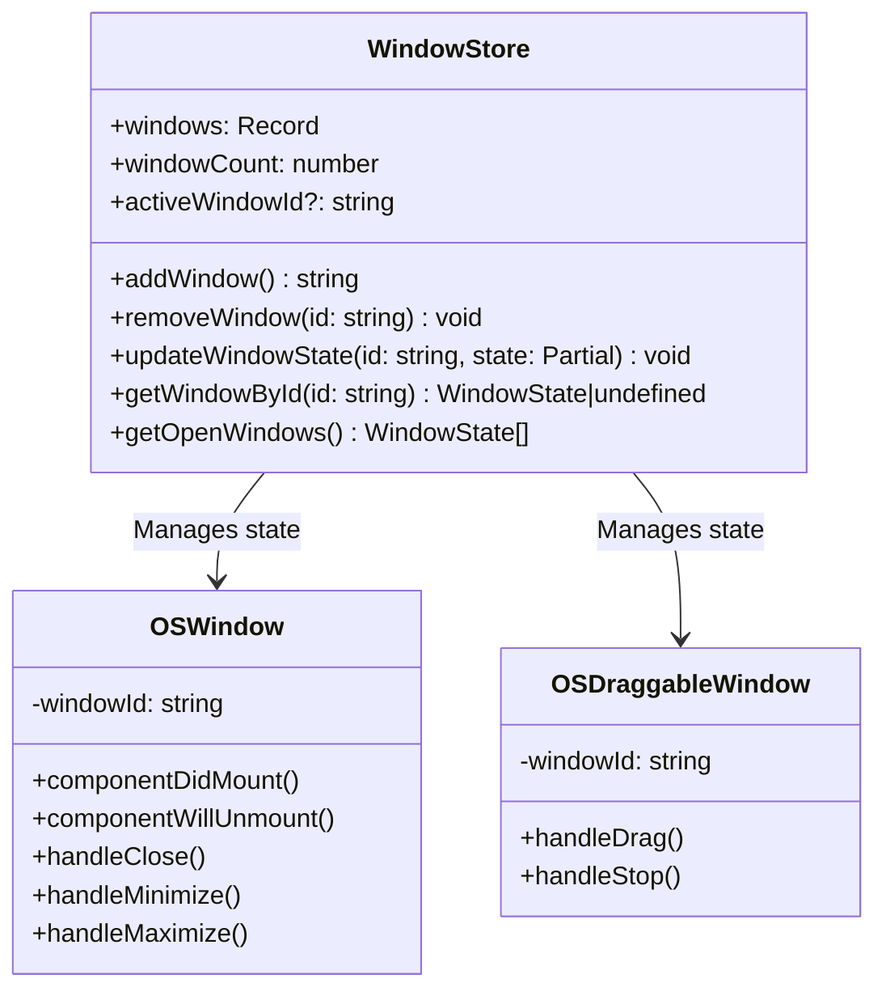

# OS UI State Store Design

## Overview

This document outlines the design for a client-side state store to manage application state and track opened windows in the OS UI project.

## Current Analysis

### Window Components
- `OSWindow`: Basic window component with state management (open/closed/minimized/maximized)
- `OSDraggableWindow`: Draggable version with additional positioning state
- `OSDock`: Dock component that can open windows (e.g., Calculator)

### Current State Management
- Each window component manages its own state internally using React's `useState`
- No centralized state management exists
- Window state changes are handled via callbacks (`onClose`, `onMinimize`, `onMaximize`)

## Requirements

1. **Centralized State Management**: Track all windows and their states in one place
2. **Window Count Tracking**: Maintain count of currently opened windows
3. **Window Identification**: Unique identifiers for each window instance
4. **State Persistence**: Maintain state across component re-renders
5. **Performance**: Efficient updates and minimal re-renders

## Proposed Architecture

### Store Structure

```typescript
interface WindowState {
  id: string;
  title: string;
  type: 'basic' | 'draggable' | 'calculator' | string;
  state: 'open' | 'minimized' | 'maximized' | 'closed';
  position?: { x: number; y: number }; // For draggable windows
  size?: { width: number; height: number }; // For resizable windows
  zIndex?: number; // For window stacking order
  createdAt: Date;
  updatedAt: Date;
}

interface AppState {
  windows: Record<string, WindowState>;
  windowCount: number;
  activeWindowId?: string;
  // Additional app-wide state can be added here
}

interface WindowStore extends AppState {
  // Actions
  addWindow: (window: Omit<WindowState, 'id' | 'createdAt' | 'updatedAt'>) => string;
  removeWindow: (id: string) => void;
  updateWindowState: (id: string, state: Partial<WindowState>) => void;
  setWindowPosition: (id: string, position: { x: number; y: number }) => void;
  bringToFront: (id: string) => void;
  closeAllWindows: () => void;
  minimizeAllWindows: () => void;

  // Selectors
  getWindowById: (id: string) => WindowState | undefined;
  getWindowsByType: (type: string) => WindowState[];
  getOpenWindows: () => WindowState[];
  getWindowCount: () => number;
  getActiveWindow: () => WindowState | undefined;
}
```

### Implementation Approach

1. **Zustand Store**: Use Zustand for lightweight, efficient state management
2. **Window Registration**: Windows register themselves with the store on mount
3. **State Synchronization**: Store state becomes the source of truth for window state
4. **Callback Integration**: Existing callback system remains for backward compatibility

### Store Implementation Plan



### Window Lifecycle

1. **Mounting**:
   - Window component generates unique ID
   - Registers with store via `addWindow()`
   - Store increments `windowCount`

2. **State Changes**:
   - Window calls store methods (`updateWindowState`, etc.)
   - Store updates state and notifies subscribers
   - Window components react to state changes

3. **Unmounting**:
   - Window calls `removeWindow()` on unmount
   - Store decrements `windowCount`
   - Cleanup window state

### Integration Strategy

1. **Create Store**: Implement Zustand store with defined interface
2. **Modify Window Components**: Update to use store for state management
3. **Add Provider**: Create React context provider for store access
4. **Update Callbacks**: Ensure existing callbacks work with new system
5. **Add Hooks**: Create custom hooks for common window operations

### Performance Considerations

- Use Zustand's selector system for efficient subscriptions
- Memoize derived state (e.g., `getOpenWindows`)
- Batch state updates where possible
- Minimize store state to essential data only

### Backward Compatibility

- Maintain existing component APIs
- Provide migration path for existing implementations
- Support both store-managed and local state modes initially
